# 🚗 UniRide

Uma plataforma web de caronas desenvolvida com **PHP**, **MySQL** e **JavaScript**, criada para conectar estudantes universitários que possuem vagas no carro com alunos que precisam de carona até o campus, reduzindo custos de transporte e incentivando a colaboração entre os alunos.

O projeto foi desenvolvido para a disciplina de **Experiência Criativa** do curso de **Engenharia de Software** da **PUCPR**, com foco em adquirir experiência prática na construção completa de uma aplicação real: da documentação e modelagem UML até a implementação, organizada em Sprints alinhadas com as necessidades do cliente.

---

## 📸 Demonstração

**Página inicial**

Landing page pública com a apresentação da proposta do UniRide e chamada para cadastro.

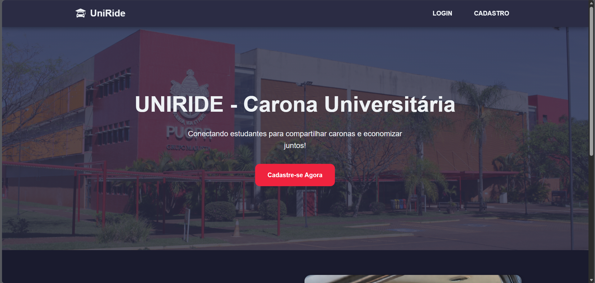

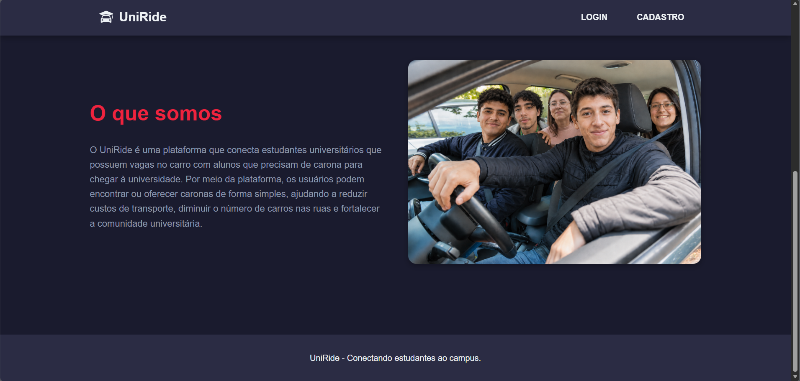

**Cadastro e login**

Cadastro de conta com dados pessoais, opção de virar motorista e, nesse caso, coleta dos dados da CNH.

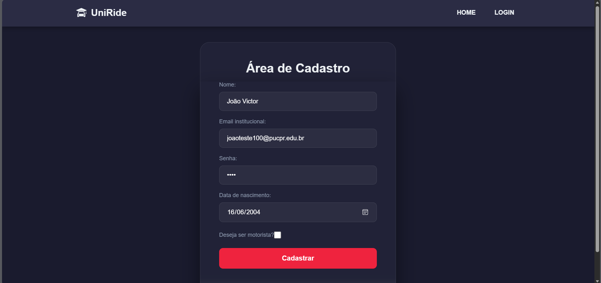

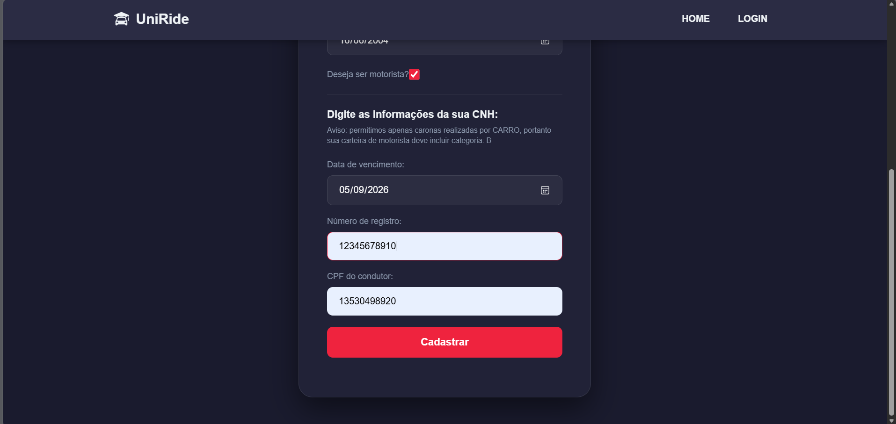

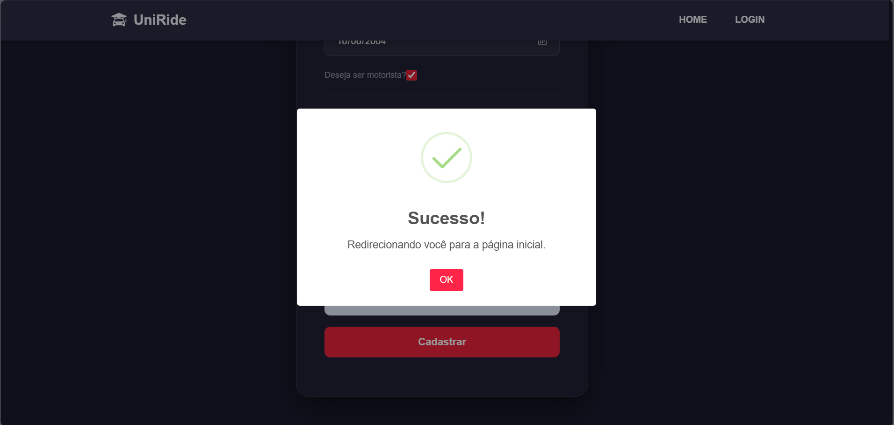

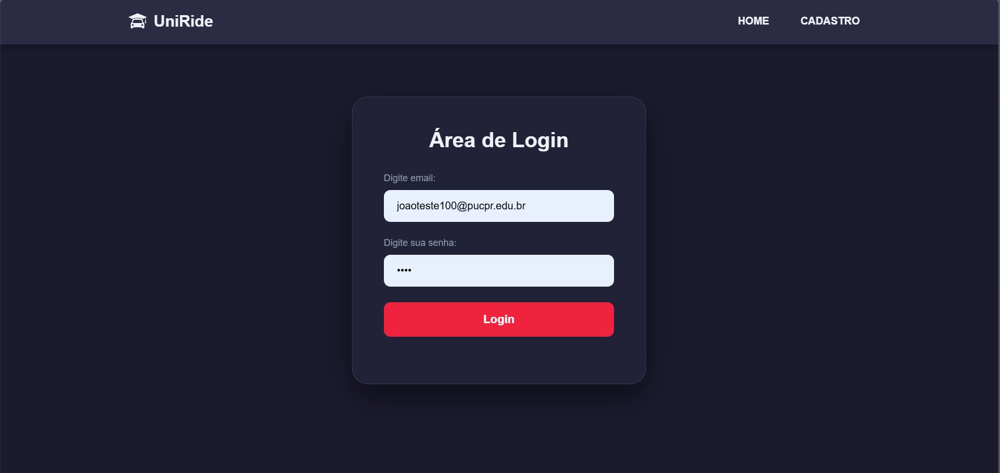

**Página principal (Home)**

Após o login, o usuário pode filtrar caronas por tipo de oferta e endereço, além de visualizar os grupos de viagem disponíveis.

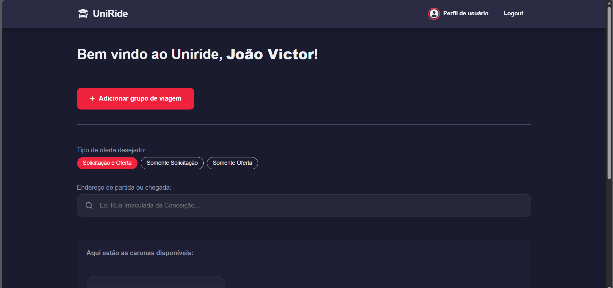

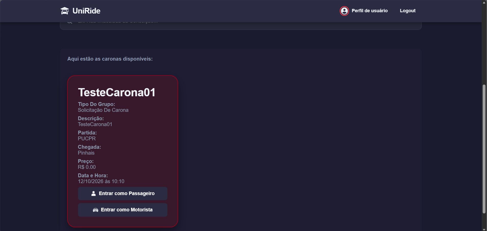

**Cadastro de grupo de viagem**

Criação de um novo grupo de carona, com origem, destino e periodicidade (avulsa ou recorrente).

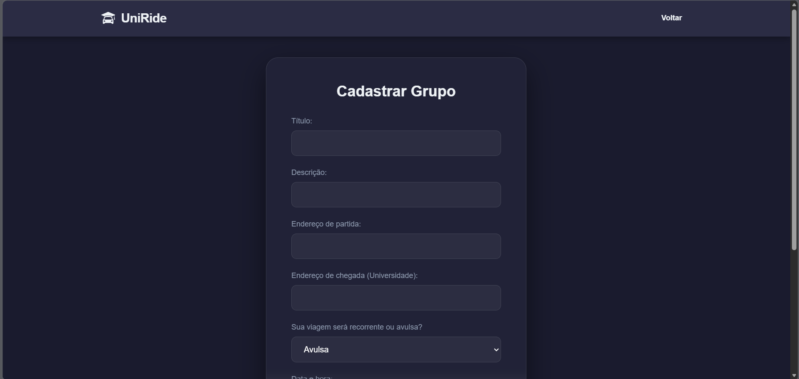

**Perfil do usuário**

Área do perfil com dados pessoais, solicitações de entrada em grupos, histórico de caronas e veículos cadastrados.

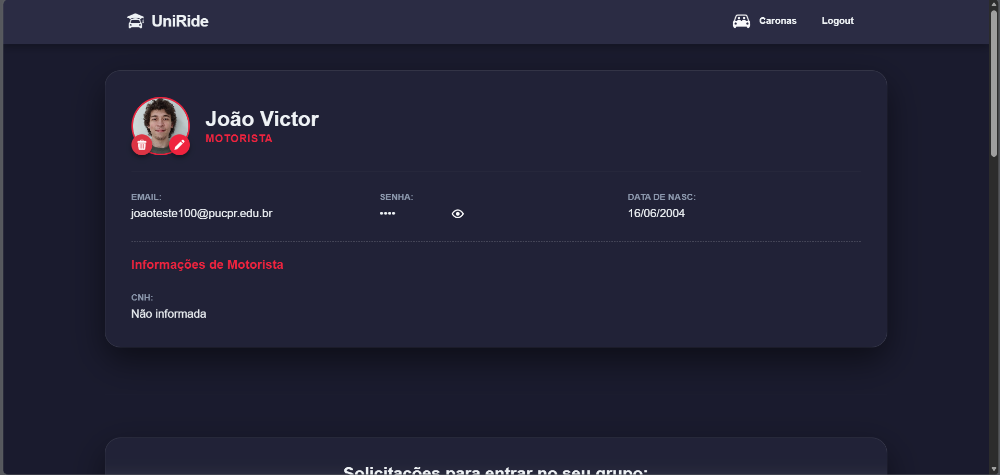

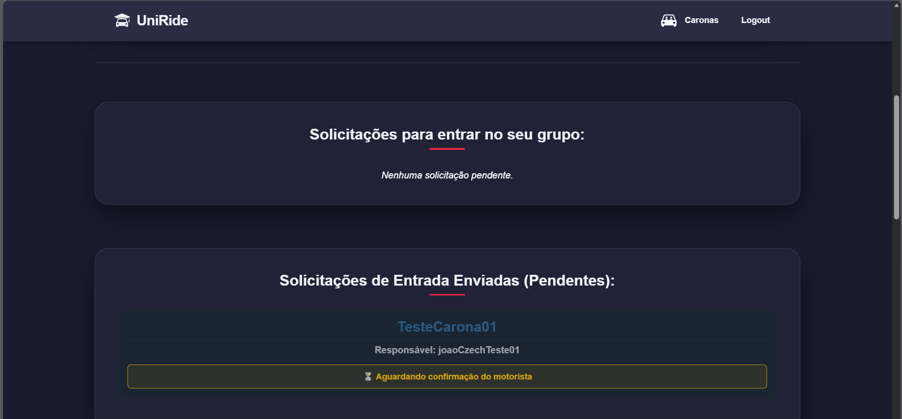

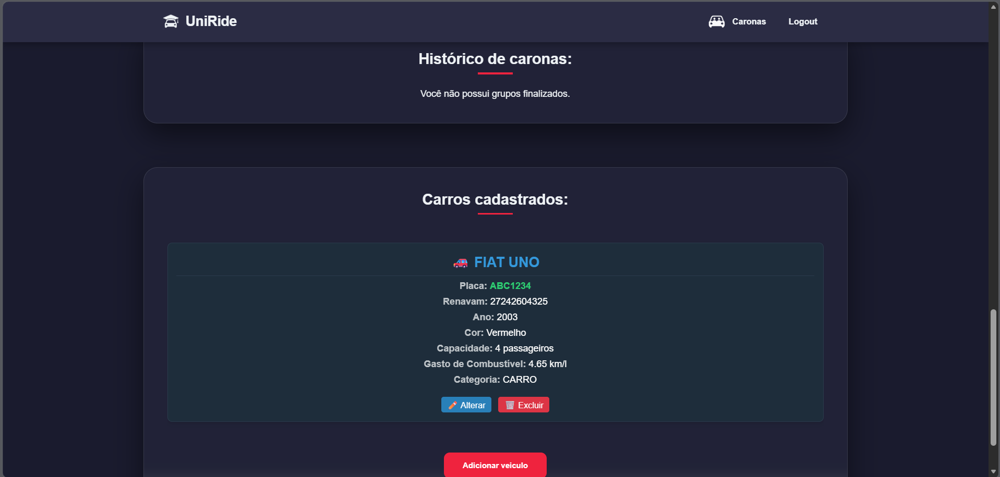

**Cadastro de veículo**

Motoristas podem cadastrar seus veículos informando placa, RENAVAM e demais dados do carro.

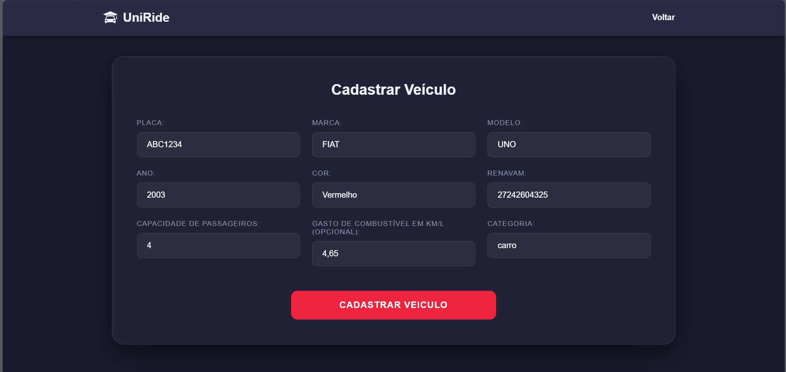

**Painel administrativo**

Painel para administradores gerenciarem os usuários cadastrados na plataforma.

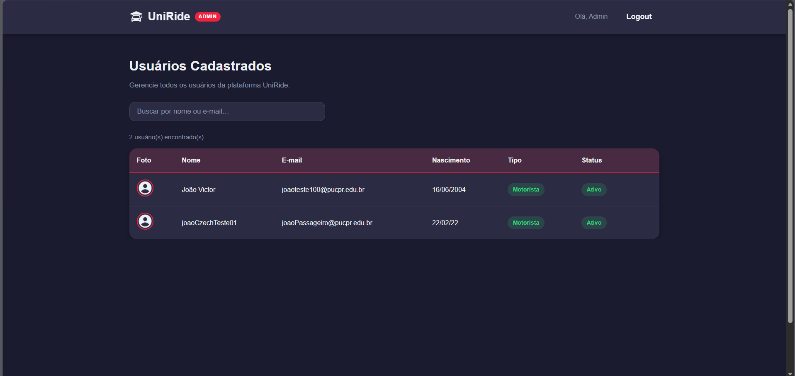

---

## ✨ Funcionalidades

- 🔐 Cadastro e login de usuários, com opção de se tornar motorista informando os dados da CNH
- 🚙 Cadastro, edição e exclusão de veículos, com validação de placa e RENAVAM
- 🧑‍🤝‍🧑 Criação de grupos de viagem, do tipo **avulsa** ou **recorrente**, com origem, destino, data e horário
- 🔎 Busca de caronas disponíveis por endereço de partida ou chegada e por tipo de oferta (solicitação e/ou oferta)
- 📥 Envio e gerenciamento de solicitações para entrar em um grupo, com aprovação pelo motorista responsável
- 💬 Chat em grupo entre os membros de uma carona
- ⭐ Avaliação do grupo ao final da viagem
- 🏁 Controle do ciclo de vida da viagem, com grupos ativos e finalizados
- 🛠️ Painel administrativo para gerenciar os usuários cadastrados na plataforma
- 🖼️ Upload e remoção de foto de perfil

---

## 🔄 Como funciona

O UniRide organiza a aplicação em módulos, cada um responsável por uma parte do fluxo de uso da plataforma:

### Cadastro e autenticação

Usuários se cadastram informando dados pessoais e, opcionalmente, os dados da CNH para se tornarem motoristas. O login utiliza sessões PHP, validadas em todas as páginas restritas por scripts dedicados de verificação de sessão.

### Grupos de viagem

Um motorista cria um grupo de viagem (avulso ou recorrente), definindo origem, destino, data/horário e demais detalhes. Outros usuários podem solicitar entrada no grupo, e o motorista aprova ou recusa as solicitações. Ao final, o grupo pode ser finalizado, ficando registrado no histórico de caronas do usuário.

### Perfil do usuário

Área central onde o usuário gerencia seus dados, veículos, solicitações pendentes (enviadas e recebidas) e histórico de caronas.

### Chat e avaliação

Membros de um mesmo grupo de viagem podem trocar mensagens em um chat dedicado. Ao final da carona, o grupo pode ser avaliado.

### Painel administrativo

Área separada, restrita a administradores, para consulta e gerenciamento dos usuários cadastrados na plataforma.

---

## 🛠️ Tecnologias utilizadas

- HTML5
- CSS3
- JavaScript
- PHP
- MySQL (via `mysqli`)
- SweetAlert2

---

## 📂 Estrutura do projeto

```text
Uniride/
│
├── admin/                    # Painel administrativo
├── cadastro/                 # Página de cadastro de usuário
├── login/                    # Página de login
├── home/                     # Página principal (pós-login)
├── viagens/                  # Criação e consulta de grupos de viagem
├── perfilUsuario/            # Perfil, veículos, solicitações e avaliação
├── chatMensagens/            # Chat entre membros de um grupo
├── php/                       # Rotas/serviços PHP compartilhados (login, cadastro, sessão)
├── javascript/                # Scripts compartilhados (login, cadastro, validação de sessão)
├── css/                        # Estilos de cada módulo
├── assets/                     # Ícones e imagens da interface
├── capturas_de_tela/           # Capturas de tela utilizadas neste README
├── bancoUnirideFinal.sql       # Script de criação do banco de dados
└── README.md
```

---

## ⚙️ Como executar

### 1. Clone o repositório

```bash
git clone https://github.com/JoaoVictor9805/Uniride.git

cd Uniride
```

---

### 2. Configure o ambiente PHP + MySQL

O projeto foi desenvolvido utilizando **XAMPP** (Apache + MySQL + PHP). Instale o XAMPP e coloque a pasta do projeto dentro do diretório `htdocs`.

---

### 3. Crie o banco de dados

1. Inicie o Apache e o MySQL pelo painel do XAMPP.
2. Acesse o **phpMyAdmin**.
3. Crie um banco chamado `Uniride`.
4. Importe o arquivo `bancoUnirideFinal.sql` para criar as tabelas.

---

### 4. Configure a conexão com o banco

Verifique o arquivo `php/conexao.php` e ajuste servidor, porta, usuário e senha de acordo com a sua configuração do MySQL:

```php
$servidor = "localhost:3307";
$usuario  = "root";
$senha    = "";
$banco    = "Uniride";
```

---

### 5. Acesse a aplicação

Com o Apache em execução, acesse:

```
http://localhost/Uniride/home/index.html
```

---

## 📌 Dependências

O projeto faz uso das seguintes ferramentas:

- **PHP** e **MySQL (mysqli)** para o backend e persistência dos dados;
- **XAMPP** como ambiente local de desenvolvimento;
- **SweetAlert2** para alertas e modais de confirmação no frontend;
- **JavaScript** puro para a interatividade e comunicação com o backend via requisições assíncronas.

---

## ⚠️ Observações

- O banco de dados (`bancoUnirideFinal.sql`) precisa ser importado manualmente antes da primeira execução.
- As credenciais de conexão com o banco em `php/conexao.php` **não acompanham valores de produção** e devem ser ajustadas para o ambiente local de cada usuário.
- Algumas categorias de veículo e regras de validação (como RENAVAM e CPF) seguem os requisitos funcionais definidos na documentação do projeto (RQ01–RQ29).

---

## 🎯 Objetivos do projeto

Este projeto foi desenvolvido com o objetivo de praticar conceitos importantes de Engenharia de Software, entre eles:

- levantamento e documentação de requisitos funcionais junto a um cliente;
- modelagem UML (casos de uso, classes/domínio, máquina de estados e sequência) seguindo o padrão BCE;
- desenvolvimento de uma aplicação web completa com PHP e MySQL;
- organização do código em módulos por funcionalidade;
- gerenciamento de sessões e controle de acesso;
- manipulação de formulários e eventos com JavaScript;
- planejamento e execução do projeto em Sprints.

---

## 📚 Principais aprendizados

Durante o desenvolvimento deste projeto foi possível aprofundar conhecimentos em diferentes áreas do desenvolvimento de software, incluindo:

- Modelagem UML aplicada a um projeto real, incluindo refinamento de diagramas de caso de uso, classes/domínio e sequência ao longo das Sprints;
- Desenvolvimento de aplicações web com **PHP** e integração com **MySQL**;
- Gerenciamento consistente de sessões PHP entre múltiplos módulos da aplicação;
- Criação de padrões reutilizáveis de validação de formulários (como dígitos verificadores de RENAVAM e CPF);
- Implementação de um ciclo de vida completo de entidades (grupos de viagem avulsos e recorrentes, com status ativo/finalizado);
- Tratamento de bugs relacionados a sessões PHP e restrições de chave estrangeira no banco de dados;
- Integração de bibliotecas externas como o **SweetAlert2** para melhorar a experiência do usuário;
- Organização de um projeto em módulos por funcionalidade (cadastro, viagens, perfil, chat, admin);
- Trabalho em equipe em um projeto de longa duração, com documentação formal e alinhamento contínuo com os requisitos do cliente.


## 📄 Licença

Este projeto foi desenvolvido para fins acadêmicos, na disciplina de Experiência Criativa do curso de Engenharia de Software da PUCPR.

---

## 🤖 Uso de inteligência artificial

O uso de inteligência artificial foi realizado para auxiliar no desenvolvimento do projeto. Muitas vezes construindo código, documentação ou replicação de código já existente para poupar trabalho manual. Os códigos produzidos foram revisados e analisados pelos membros, validando sua qualidade. Os principais modelos de inteligência artificial utilizados foram: Claude AI e Chat GPT.
